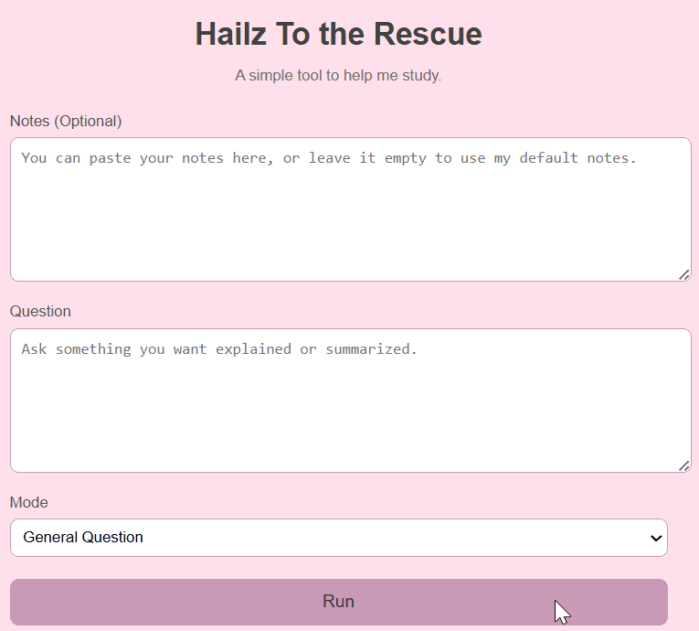
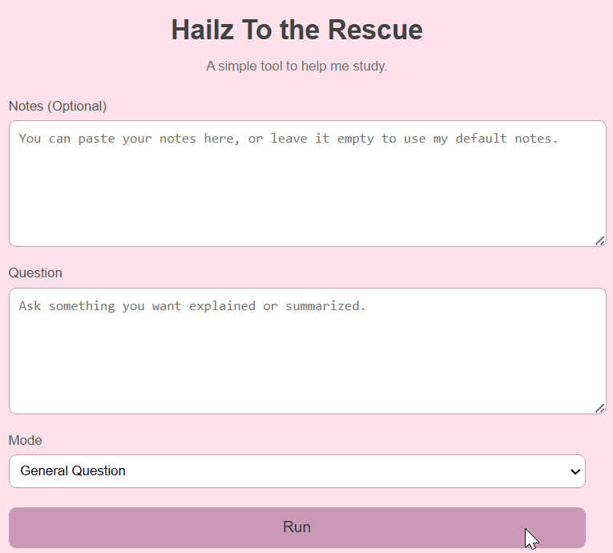
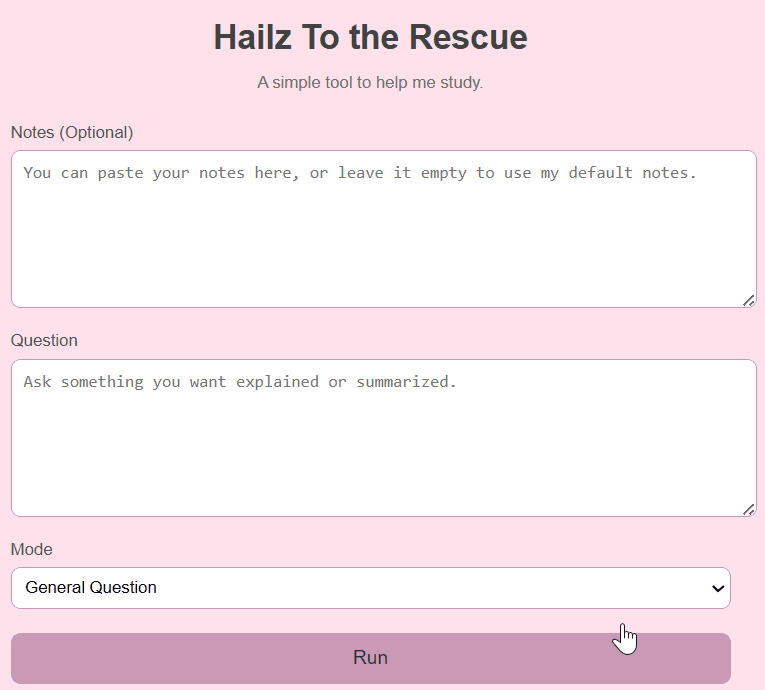

# Hailz Helper – Healthy Eating Study Buddy

Hailz Helper is a small, clean LLM-powered study tool that helps students understand healthy eating concepts.

The app takes a question, looks through your notes, and gives you an answer, a summary, an explaination or a quiz-style study set depending on which mode you choose.

Everything is grounded through a lightweight RAG pipeline so responses stay close to the notes.

## Goal of the App

Helping a student study healthy eating by asking questions over their notes with RAG.

The user can type a question, optionally add their own notes, choose a response style, and get helpful explanations.

The tone is friendly and feels like a study buddy who just wants you to understand things.

<p align="center">
  
</p>

## Question Demo
<p align="center">
  
</p>

## Summary Demo
<p align="center">
  
</p>

## Quiz Demo
<p align="center">
  
</p>

## Explaination Demo
<p align="center">
  
</p>

## Core Feature
Users interact with a real, working end-to-end flow:

- They type a question

- Notes are searched using embeddings

- Relevant chunks are selected

- Gemini generates an answer in a clean, friendly format

## Enhancement - RAG
I implemented a lightweight RAG system:

- Notes are chunked

- Each chunk is embedded

- The question is embedded

- Cosine similarity finds the two best chunks

- Those chunks are passed to Gemini to keep answers grounded

- Users can provide their own notes, making the tool flexible

## Safety & Robustness
The app includes:

  - A system prompt that explains what the model can and cannot do

  - Prompt-injection checks - ignore instructions and more

  - Input length restriction with a friendly fallback message

  - Error handling so the app never crashes in the UI

<p align="center">
  
</p>

<p align="center">
  
</p>

## Telemetry
Each request logs:

  - Timestamp

  - Question asked

  - Mode selected

  - Latency

  - Token estimate

  - Whether the answer was cached

  - All logs appear in requests.log

## Offline Eval
I created:

  - tests.json with more than 15 inputs and expected patterns

  - run_tests.py which runs all tests and prints a pass rate

<p align="center">
  
</p>

## Reproducibility
Repo includes:

  - README.md

  - requirements.txt

  - .env.example

  - Seed data

  - A clean folder structure

  - Simple steps to run the app on any machine

## Nice to haves
  - Response caching

  - Visually clean bullet formats

  - A little loading message

  - Smooth spacing and easy readability

  - A warm study buddy tone

## How it Works
1. Notes are loaded (either my notes or pasted by the user).

2. They get split into small chunks.

3. Gemini embeddings are generated for each chunk.

4. The question is embedded too.

5. The most similar two chunks are chosen.

6. They are sent to Gemini along with instructions.

7. Gemini replies in the selected style (general, summary, explain, or quiz).

8. The answer appears on the page in a clean, easy-to-read format.

## How to run

1. Clone repo
```
git clone https://github.com/HaileyDsouza/Hailz_Helper_A2

cd Hailz_Helper_A2
```

2. Install dependencies
```
pip install -r requirements.txt
```

3. Add your Gemini API key

   Copy .env.example → .env
   
   Fill in your API key in the .env file

4. Start the server
```
python app.py

```
Then open: http://127.0.0.1:5000/

## Folder Structure
```
Hailz_Helper_A2/
├── app.py
├── rag.py
├── telemetry.py
├── safety.py
├── tests.json
├── run_tests.py
├── requirements.txt
├── .env.example
├── README.md
├── tech_note.md
│
├── assets/
│   └── (gifs)
│ 
├── templates/
│   └── index.html
│
├── static/
│   └── style.css
│
├── data/
│   └── notes.txt
│
└── cache/
  └── answers.json   (is auto-created after first run)
  ```
